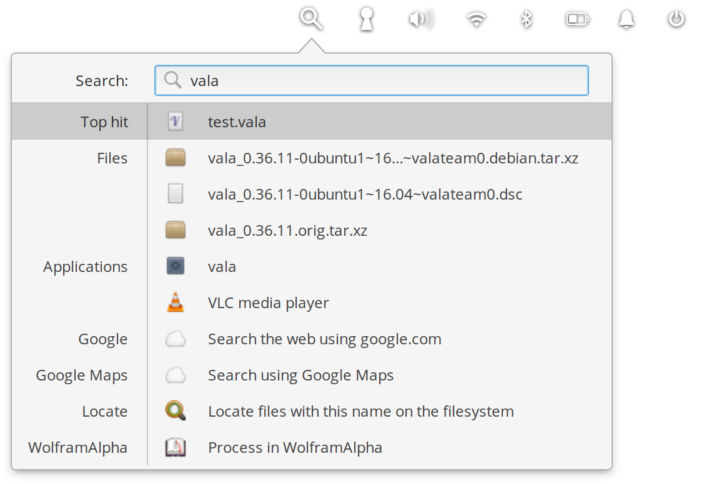

# Indicator Synapse


<div align="center">
  <h1 align="center">Synapse indicator</h1>
  <h3 align="center">Search everything</h3>
    <a href="https://elementary.io">
      
    </a>
</div>

<div align="center">
    <span align="center">
        
    </span>
</div>
</br>


This codebase bundles the original [Synapse Launcher project](https://launchpad.net/synapse-project) code and retains its original license. It does not use Synapse's UI part and instead provides a Wingpanel indicator.

### Global Shortcut

To open the indicator via shortcut, add a custom shortcut in your keyboard settings with the following command:
```
wingpanel --toggle-indicator=io.github.ellie_commons.indicator-synapse
```
## 🏗️ Building

Install dependencies with:

```bash
sudo apt install libglib2.0-dev libgranite-dev libwingpanel-dev valac meson libzeitgeist-2.0-dev
```

Run `meson` to configure the build environment and then `ninja` to build

```bash
meson build --prefix=/usr
cd build
ninja
```

To install

```bash
sudo ninja install
```

To uninstall, same but "uninstall"
